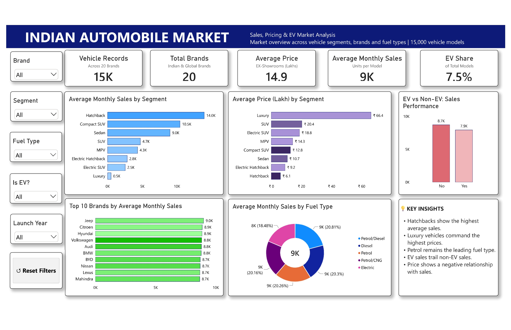

# Indian Automobile Market Analysis – Power BI

## 📊 Project Overview

This project presents an interactive Power BI dashboard for analyzing the Indian automobile market using vehicle-level data.

The dashboard focuses on vehicle sales, pricing, market segments, automobile brands, fuel types, and electric vehicle (EV) performance. It provides an interactive view of market trends and helps identify key patterns across different vehicle categories.

The project demonstrates practical skills in data preparation, Power Query, DAX, data visualization, dashboard design, and analytical storytelling.

---

## 📸 Dashboard Preview



---

## 🎯 Project Objectives

The main objectives of this project are to:

- Analyze average monthly sales across different vehicle segments
- Compare average vehicle prices across segments
- Identify top-performing automobile brands
- Analyze average monthly sales by fuel type
- Compare EV and non-EV sales performance
- Analyze the relationship between vehicle price and monthly sales
- Build an interactive single-page business intelligence dashboard

---

## 📁 Dataset

The dataset contains approximately **15,000 vehicle records** covering multiple automobile brands, models, segments, fuel types, pricing information, sales data, and EV-related attributes.

### Key Dataset Columns

| Column | Description |
|---|---|
| Brand | Automobile brand |
| Model | Vehicle model |
| Launch Year | Year the vehicle was launched |
| Segment | Vehicle market segment |
| Fuel Type | Fuel type of the vehicle |
| Variants | Number of variants |
| Ex-Showroom Price (₹ Lakhs) | Vehicle price range |
| Monthly Sales (Units) | Monthly sales volume |
| Is EV? | Indicates whether the vehicle is electric |
| Battery / Mileage | Battery capacity or mileage information |
| Notable Features | Important vehicle features |
| Average Price (₹ Lakhs) | Calculated average vehicle price |
| Mileage (kmpl) | Vehicle mileage |
| Range (km) | EV driving range |

---

## 🛠️ Tools & Technologies

- **Power BI Desktop**
- **Power Query**
- **DAX**
- **Python**
- **Pandas**
- **Data Visualization**
- **Exploratory Data Analysis (EDA)**
- **CSV**

---

## 🔄 Project Workflow

```text
Raw Dataset
     ↓
Python / Pandas
     ↓
Data Cleaning & Feature Engineering
     ↓
Cleaned CSV Dataset
     ↓
Power BI / Power Query
     ↓
Data Preparation & Validation
     ↓
DAX Measures
     ↓
Interactive Visualizations
     ↓
Single-Page Power BI Dashboard
```

---

## 🧹 Data Preparation

The dataset was initially explored and prepared using Python and Pandas.

The preparation process included:

- Inspecting the dataset structure
- Cleaning and preparing price information
- Calculating average vehicle price
- Extracting mileage and range information
- Creating derived analytical columns
- Preparing the final dataset for visualization

The cleaned dataset was then imported into Power BI for further preparation and analysis.

---

## 📐 DAX Measures

The dashboard uses DAX measures to perform dynamic calculations.

### Vehicle Records

```DAX
Vehicle Records =
COUNTROWS('Auto Market Data')
```

### Total Brands

```DAX
Total Brands =
DISTINCTCOUNT('Auto Market Data'[Brand])
```

### Average Price

```DAX
Average Price =
AVERAGE('Auto Market Data'[Average Price (₹ Lakhs)])
```

### Average Monthly Sales

```DAX
Average Monthly Sales =
AVERAGE('Auto Market Data'[Monthly Sales (Units)])
```

### EV Share %

```DAX
EV Share % =
DIVIDE(
    CALCULATE(
        COUNTROWS('Auto Market Data'),
        'Auto Market Data'[Is EV?] = "Yes"
    ),
    [Vehicle Records]
)
```

These measures allow the dashboard to respond dynamically to user selections and filters.

---

## 📊 Dashboard Features

The dashboard is designed as a **single-page interactive business intelligence report**.

### KPI Cards

The dashboard provides the following key metrics:

- Vehicle Records
- Total Brands
- Average Price
- Average Monthly Sales
- EV Share

### Interactive Filters

Users can filter the dashboard using:

- Brand
- Segment
- Fuel Type
- EV Status
- Launch Year

### Visualizations

The dashboard includes:

1. **Average Monthly Sales by Vehicle Segment**
2. **Average Price by Vehicle Segment**
3. **Top 10 Brands by Average Monthly Sales**
4. **Average Monthly Sales by Fuel Type**
5. **EV vs Non-EV Sales Performance**

### Additional Feature

A **Reset Filters** button allows users to quickly return the dashboard to its default state.

---

## 🔍 Key Insights

The analysis highlights several important patterns in the dataset:

- Hatchbacks show the highest average monthly sales among the vehicle segments.
- Luxury vehicles have the highest average price.
- Petrol is the leading fuel type in the dataset.
- EVs have lower average monthly sales compared with non-EV vehicles.
- Vehicle price shows a negative relationship with monthly sales.

---

## 📂 Project Files

| File | Description |
|---|---|
| `Indian_Automobile_Market_Analysis.pbix` | Power BI source file |
| `Indian_Automobile_Market_Analysis.pdf` | PDF export of the dashboard |
| `Indian_Automobile_Market_Dashboard.png` | Dashboard preview image |
| `indian_vehicle_data_cleaned.csv` | Cleaned dataset used for the dashboard |
| `README.md` | Project documentation |

---

## 🚀 Skills Demonstrated

This project demonstrates practical experience with:

- Data Cleaning
- Exploratory Data Analysis
- Power Query
- DAX
- Data Modeling
- KPI Development
- Interactive Data Visualization
- Dashboard Design
- Business Intelligence
- Analytical Storytelling

---

## 👤 Author

**Ganesh Jogi**

B.Tech Electrical Engineering | Aspiring Data Analyst

**Skills:** Python | SQL | Power BI | Data Analytics | Data Visualization

---

## ⭐ Project Highlights

- **15,000** vehicle records
- **20** automobile brands
- Single-page interactive Power BI dashboard
- Dynamic DAX measures
- Interactive slicers
- Reset Filters functionality
- EV vs Non-EV analysis
- Segment and brand-level analysis
